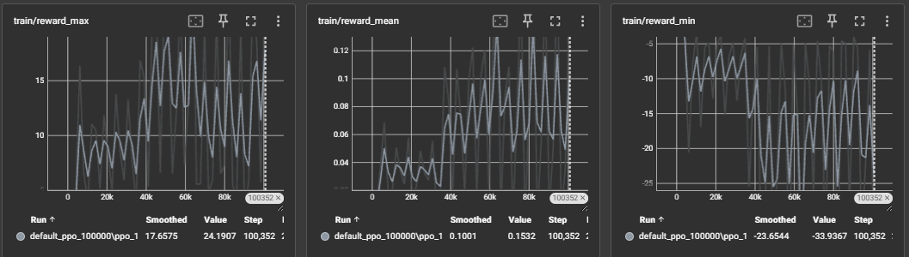
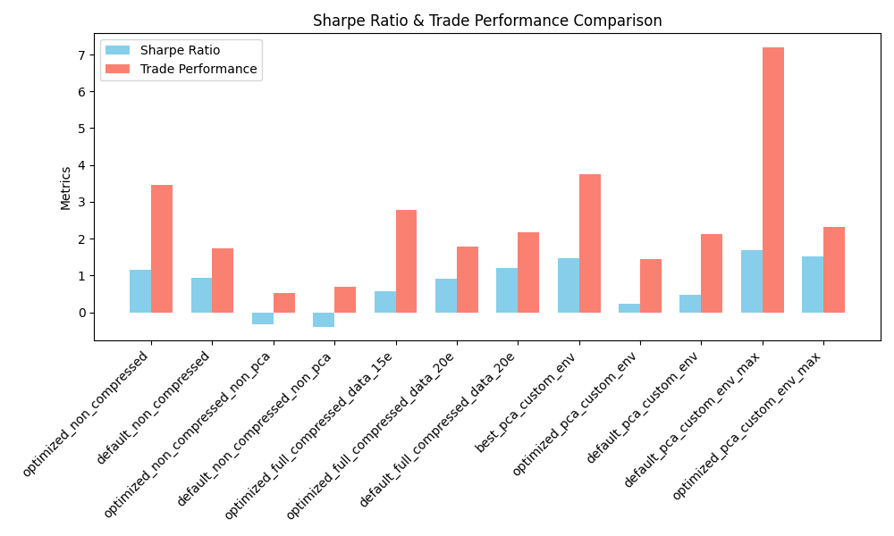
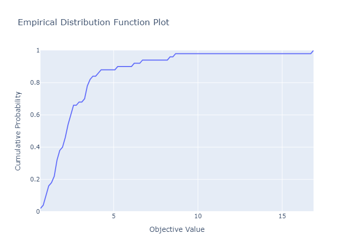
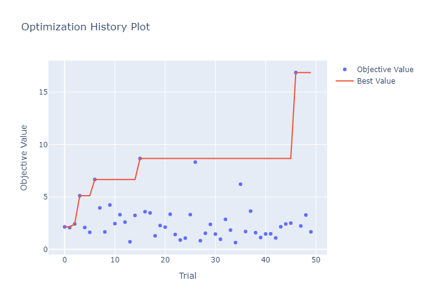
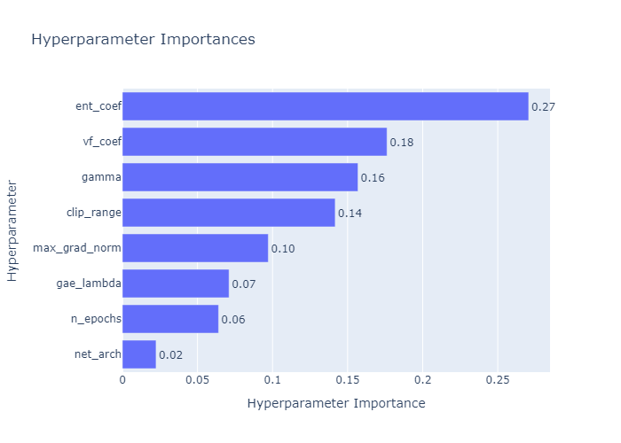

# 🧠 Reinforcement Learning-Based Trading Agent with AutoEncoders, Optuna, FinRL and multiprocessing

This project presents a professional-grade **reinforcement learning (RL) trading agent** trained on **multi-asset stock data** using the [FinRL](https://github.com/AI4Finance-Foundation/FinRL) framework. The agent is enhanced with **custom data preprocessing**, **autoencoder-based compression**, **PCA analysis**, and **hyperparameter optimization using Optuna**.  

The goal is to create a robust, risk-aware agent capable of operating on real historical stock data, optimizing for long-term returns while minimizing volatility — measured via **Sharpe Ratio** and other professional trading metrics.

---

## ✨ Key Features

- 📈 **Multi-stock agent**: RL agent predicts actions for 25+ stocks simultaneously (`Buy`, `Hold`, or `Sell` per asset).
- 🧠 **Autoencoder compression**: Compresses high-dimensional financial data into 7-dimensional latent vectors while preserving 96–99% reconstruction accuracy.
- 📊 **Reward engineering**: Combines FinRL's default reward with a **Sharpe Ratio-based custom reward** to improve risk-adjusted performance.
- 🔍 **Hyperparameter tuning**: Automated search using **Optuna**, optimizing PPO agents on Sharpe Ratio, reward stability, and other metrics.
- 🛠️ **Modular pipeline**: A central `Pipeline` class (see `main.py`) handles **data preprocessing, training, validation, optimization, config saving/loading** — all cleanly structured.
- 🧪 **Extensive validation**: Backtests over multiple datasets with different compression techniques, custom envs, and parameter sets — all metrics logged and visualized.
- 🔁 **Multiprocessing**: Parallelized training and validation to reduce time and support large-scale experimentation.
- 🚀 **FastAPI interface**: Includes a lightweight API server for serving trained agents (`/predict` and `/validate` endpoints).

---

## 🧰 Project Workflow

This project is designed with modularity and reproducibility in mind. A centralized `Pipeline` class (see `main.py`) manages the entire process, including data handling, training, and evaluation.  

You can perform any of the following core tasks by changing the config mode:

- 🏗️ **Mode: create**  
  Initializes new datasets from raw data. Supports pre-processing, feature selection, and compression (AutoEncoder, PCA, or raw).

- 🤖 **Mode: train**  
  Trains the RL agent using Proximal Policy Optimization (PPO) from FinRL. Logging is handled by TensorBoard.

- 📊 **Mode: validate**  
  Evaluates agent performance on unseen data (test set). Generates metrics like Sharpe Ratio, Total Return, and visualized trades.

- ⚙️ **Mode: optimize**  
  Runs **Optuna** for hyperparameter search across PPO agent configs. Each trial is validated and compared by Sharpe ratio and risk measures.

- 💾 **Mode: load_config**  
  Reuses previously saved hyperparameter configurations for retraining or serving.

Each run automatically creates a structured directory under `results/`, storing:

- Environment settings and model configs
- Logs (CSV, JSON)
- Tensorboard scalars
- Plots and performance graphs


## 🔬 Model Comparison & Optimization

This project includes thorough experimentation with different data processing pipelines, reward structures, and PPO hyperparameters. Optimization was done using [Optuna](https://optuna.org/) with both default and custom reward functions.

The best results came from using:
- A **custom reward function**: `Sharpe + 0.5 × default reward`
- A **custom environment** that stabilizes volatility and emphasizes consistent growth
- Surprisingly, **default PPO hyperparameters** outperformed all tuned ones after long training (100k steps)

### 📌 Key Metrics for Best Performing Model (Default Params + Custom Env)
| Metric                  | Value    |
|------------------------|----------|
| Annual Return          | **20.69%** |
| Cumulative Return      | 18.72%   |
| Sharpe Ratio           | **1.68** |
| Calmar Ratio           | 2.89     |
| Max Drawdown           | -7.14%   |
| Sortino Ratio          | **2.50** |
| Trade Perf (Win/Loss)  | **7.20** |

### 📸 Sample Screenshot (Best Checkpoint)



This TensorBoard snapshot shows key reward metrics after training the default PPO model for 100,000+ steps:

- `reward_max`: Peaks as high as **24.19**, suggesting strong individual episodes.
- `reward_mean`: Steady upward trend to **~0.15**, confirming policy improvement.
- `reward_min`: Occasionally drops to **-33**, due to PPO's inherent exploration.

These logs demonstrate stable and progressive learning over time, validating the effectiveness of the custom reward function.


### 🧪 Experiment Summary (20k Steps)

| Name | Sharpe | Calmar | Max DD | Trade Perf | Notes |
|------|--------|--------|--------|-------------|-------|
| 🏆 `default_pca_custom_env_max` | **1.68** | **2.89** | -7.1% | **7.20** | Custom env + PCA, no compression, 100k steps |
| `optimized_pca_custom_env_max` | 1.53 | 2.99 | -6.2% | 2.32 | 25 trials, 10k steps |
| `default_full_compressed_data_20e` | 1.20 | 1.88 | -8.0% | 2.16 | AutoEncoder + PCA (20e), default params |
| `optimized_full_compressed_data_15e` | 0.57 | 0.64 | -8.1% | 2.77 | AutoEncoder (15e), PCA, optimized |
| `optimized_non_compressed` | 1.16 | 2.06 | -7.2% | 3.47 | Raw data, 5 trials |
| `default_non_compressed` | 0.94 | 1.57 | -7.5% | 1.73 | Raw data, no tuning |












> 📌 Full experiment table [available in CSV format](comparison_results\summary_table.csv)
--- 

### 🧠 AutoEncoder-based Feature Compression (Experimental)

As part of my exploration into improving the Deep Reinforcement Learning (DRL) agent's performance, I implemented a custom AutoEncoder module to compress high-dimensional state inputs into a more compact latent representation.

This aimed to:

* Reduce noise and redundancy in financial time-series features
* Improve learning speed and generalization
* Test performance impact of compressed vs raw inputs

#### 🛠️ Architecture Variants

Two AutoEncoder variants were implemented:

* **Simple**: Shallow encoder-decoder structure with 256 → 128 → `latent_dim`
* **Deep** (used in all experiments): 256 → 128 → 512 → `latent_dim`, with optional `tanh` at the output

```python
# Example encoder from Deep AE (used in results):
nn.Sequential(
    nn.Linear(input_dim, 256),
    nn.ReLU(),
    nn.Linear(256, 128),
    nn.ReLU(),
    nn.Linear(128, 512), 
    nn.ReLU(),
    nn.Linear(512, latent_dim)  # Optional nn.Tanh() output
)
```

#### ⚙️ Training & Integration

* AutoEncoder was trained *prior* to DRL training on the full dataset
* Reconstruction loss used: **MSE**
* The encoder was then frozen and used to transform the input features before being fed into the RL agent

#### 📊 Observations

* While AutoEncoder-based compressed data did **not** consistently outperform raw features or PCA across all environments...
* It still showed **competitive results** in certain configurations (e.g. `optimized_full_compressed_data_20e`)
* Helped reduce overfitting in some shorter training runs

#### 🌱 Lessons Learned

> Incorporating learned latent spaces into RL pipelines is promising but delicate — too much compression can reduce important signals. Further improvements could include:
>
> * Sequence-aware compression (e.g. LSTM AutoEncoders)
> * Variational or contrastive representation learning
> * Hybrid latent + raw feature fusion


### 🧠 DRL Agent Training Pipeline

This section outlines the reinforcement learning pipeline used to train a stock trading agent.

#### 🧩 Framework

- **Library**: [Stable Baselines3](https://github.com/DLR-RM/stable-baselines3)
- **Algorithm**: PPO (Proximal Policy Optimization)
- **Training Duration**: Configurable via `training_timesteps` in `config.json`
- **Feature Encoding**: Uses raw, PCA, or AutoEncoder-compressed features depending on config

> All agent-related settings and flags (model name, encoding, custom reward, etc.) are controlled via `config.json`.

#### 🔁 Pipeline Overview

```text
DataLoader 
 → Optional Feature Compressor (AutoEncoder / PCA)
 → FinRL-Compatible Custom Environment
 → Optuna Hyperparameter Optimizer (optional)
 → Stable Baselines3 PPO Agent Training
 → Evaluation & Logging (TensorBoard, plots, metrics)
```

- 📉 **Custom Reward Function**: A hybrid function combining Sharpe ratio and default FinRL rewards:
  ```
  reward = sharpe + 0.5 * default_reward
  ```
- 📊 **Metrics Tracked**:
  - Sharpe Ratio
  - Average Win/Loss
  - Daily Returns
  - Final Portfolio Value
  - Action Distribution

#### 🧪 Hyperparameter Tuning

If enabled in config, the system runs Optuna optimization trials (e.g. 5 or 25) across:

- Learning rate
- AutoEncoder latent size
- Feature encoding type
- Reward function toggle
- Training duration

> The best configuration is then saved and used for final training.

---

📷 Best checkpoint training curves are visualized via TensorBoard.  
A sample plot is available in:
```
non_default_env_checkpoint_max/training_logs/image_2025-08-05_23-15-35.png
```

```python
# Example config (simplified)
  auto_encoder_training_params: dict = {},
  env_params: dict = {},
  A2C_model_kwargs: dict = {},
  PPO_model_kwargs: dict = {},
  DDPG_model_kwargs: dict = {},
  SAC_model_kwargs: dict = {},
  TD3_model_kwargs: dict = {},
  timesteps_dict: dict = {},
  opt_metrics:dict = {}, 


  compress_data_with_autoencoder = True,
  one_hot_date_features = True,
  pca_analisys = True,
  checkpoint_dir = "pipeline_checkpoint",

  model_policy = "ppo", 
  tp_metric = 'avgwl',   # specified trade_param_metric: ratio avg value win/loss
  default_env = True, 
  training_total_steps = 50_000, 
  tickers_in_data = []
```

---

This modular pipeline enables fast experimentation and reproducible DRL training workflows tailored to financial markets.

## 📁 Project Structure

The project is organized into clear functional modules to support preprocessing, training, evaluation, and deployment.

```

project-root/
├── comparison\_results/                # Comparison charts and metrics (Sharpe, table, etc.)
│   ├── sharpe\_trade\_perf\_comparison.png
│   └── summary\_table.csv
│
├── compressed\_checkpoint\_20e/        # Saved checkpoints (e.g. smaller models for testing)
│
├── data\_processing/                  # All logic related to data preprocessing and compression
│   ├── autoencoder/                  # Autoencoder model definition and training (optional)
│   │   ├── **init**.py
│   │   ├── model.py
│   │   └── trainer.py
│   ├── autoencoder\_processing.py     # Preprocessing script using trained AE model
│   ├── data\_processing.py            # Main feature engineering pipeline
│   ├── load\_data.py                  # Raw data loader (from Yahoo Finance)
│   ├── test.py                       # Utility for data pipeline testing
│   └── **pycache**/                  # Python cache files (ignored)
│
├── datasets/                         # Folder for storing raw or preprocessed datasets
│
├── env\_train\_settings/              # Custom FinRL gym environment
│   ├── env.py                        # Custom trading logic and reward shaping
│   └── **init**.py
│
├── optimization\_logging.py          # Optuna logging and visualization
├── optimization\_sampling.py         # Hyperparameter sampling strategy (Optuna)
├── trade\_performance\_code.py        # Final evaluation metrics and summaries
│
├── main.py                          # Entry point for full training + evaluation pipeline
├── config.py                        # Loads and parses `config.json` hyperparameters
├── config.json                      # Main configuration file (env settings, toggles, etc.)
│
├── df\_actions.csv                   # Logs of actions taken during final trading episode
│
├── app.py                           # \[Optional] If API or demo interface is added
├── test\_app.py                      # Tests for API if developed
│
├── Dockerfile                       # Docker setup for containerized usage
├── .dockerignore
├── .gitignore
│
├── README.md                        # You're reading it 😉
└── requirements.txt                 # All Python dependencies

```

## 🚀 How to Run the Project

To launch the full training pipeline with custom configuration, simply run:

```python
python main.py
````

This will:

* Load and process stock data
* Run hyperparameter optimization (using Optuna)
* Train DRL models with multi-training support
* Evaluate and validate saved models
* Save your final config for reproducibility

You can configure everything from `config.py`, including:

* Date ranges for training and trading
* Autoencoder usage and feature encoding
* Environment choice (default/custom)
* Total training steps
* Optimization trial count, metric preferences, etc.

### ✅ Example Pipeline (Advanced Usage)

For finer control, here’s a sample script using the `Pipeline` class:

```python
from main import Pipeline
import config
from training_utils import compare_validation_results

if __name__ == "__main__":
    pipe = Pipeline(
        start_date=config.TRAIN_START_DATE,
        end_date=config.TRAIN_END_DATE,
        start_date_trade=config.TRADE_START_DATE,
        end_date_trade=config.TRADE_END_DATE,
        compress_data_with_autoencoder=False,
        one_hot_date_features=False,
        pca_analisys=True,
        checkpoint_dir='new_checkpoint',
        default_env=False,
        training_total_steps=100_000,
        opt_metrics={'n_trials': 25}
    )

    dataframe, datapath = pipe.data_process()
    pipe.optimize(datapath)
    pipe.train(datapath)
    pipe.validate_saved_models(datapath)
    pipe.save_config()

    # Compare the validation results along all experiments 
    models_data = [
        {
            "path": r"non_compressed_checkpoint\\validation_results\\perf_stats_opt_results_ppo_5_20000.pth.csv",
            "description": "Optimization with 5 Trials, 20K training steps",
            "name": "optimized_non_compressed",
        },
        {
            "path": r"non_compressed_checkpoint\\validation_results\\perf_stats_ppo_20000_20000.pth.csv",
            "description": "Default hyperparameters, 20K training steps",
            "name": "default_non_compressed",
        },
        # ... Add more comparison entries if needed
    ]

    compare_validation_results(models_data)
```

---

✅ **Output** includes:

* TensorBoard logs
* Model checkpoints (in `checkpoint_dir`)
* Validation stats (.csv)
* Comparison plots (in `comparison_results/`)

> 💡 Use `tensorboard --logdir <your_log_dir>` to inspect training curves.

--- 

## 🛰️ FastAPI Integration for Real-Time Inference & Validation

To support **real-time inference**, this project includes a simple but functional **FastAPI server** that allows you to serve your trained trading agent via HTTP endpoints.

This makes your RL agent usable by **external applications**, **dashboards**, or even **automated trading systems** 🧠📡

### ✅ Available Endpoints

#### **`POST /predict`**

Takes in a market snapshot (`date`, `open`, `high`, `low`, `close`, `volume`, `tic`) and returns model predictions for each asset.

```bash
curl -X POST http://localhost:8000/predict -H "Content-Type: application/json" -d '{...}'
```

* **Input**: JSON market data (list of floats/strings)
* **Output**: Dict with `predicted_action` for each stock
* **Actions**: typically `Buy` / `Hold` / `Sell` encoded as one-hot or class index

#### **`POST /validate`**

Receives a historical dataset and evaluates the agent on it using the internal validation pipeline.

* **Output**: Returns performance metrics and all validation `.csv` files as JSON

---

### 🧪 Example Usage & Testing

You can test your API with real historical stock data using this simple script:

```python
from finrl.config_tickers import DOW_30_TICKER
from finrl.meta.preprocessor.yahoodownloader import YahooDownloader

# Load example stock data
df = YahooDownloader(start_date="2023-04-01",
                     end_date="2024-07-15",
                     ticker_list=DOW_30_TICKER).fetch_data()

# Build input payload
test_payload = {
    "date": df["date"].astype(str).tolist(),
    "open": df["open"].tolist(),
    "high": df["high"].tolist(),
    "low": df["low"].tolist(),
    "close": df["close"].tolist(),
    "volume": df["volume"].tolist(),
    "tic": df["tic"].tolist()   
}

import requests
import json

# Call validation endpoint
resp_validate = requests.post("http://127.0.0.1:8000/validate", json=test_payload)
print("VALIDATE:", resp_validate.status_code)
print(json.dumps(resp_validate.json(), indent=2))
```

> To start the API server:

```bash
uvicorn app:app --reload
```

---

### 🧠 Behind the Scenes

The API is powered by the same modular `Pipeline` used throughout the training pipeline. It loads your saved model config and checkpoints and performs:

* Prediction on freshly input market snapshots
* On-the-fly validation against unseen data
* Automatic pre-processing and data cleaning
* Export of validation results in a portable format

---

### 🌈 Real-World Ready

This API is a major step toward **real-world agent deployment**. While it currently works on local data, it could easily be extended to support:

* **Live market feeds**
* **Database-backed backtesting**
* **Cloud-based inference endpoints**


# Dependencies 

This project was build on Python 3.10.11
All required python libraries can be installed from ```requirements.txt```
